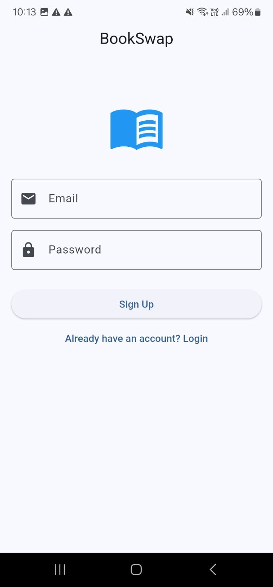
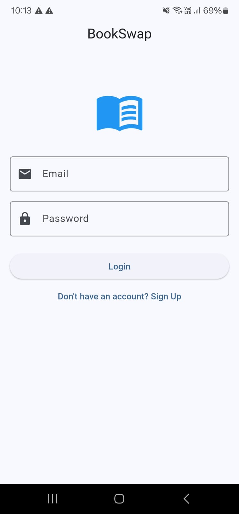

# 📚 BookSwap - Buy, Sell & Swap Books

<p align="center">
  
</p>

<p align="center">
  <strong>A Flutter-based mobile application for buying, selling, and swapping books with other users.</strong>
</p>

<p align="center">
  <a href="#features">Features</a> •
  <a href="#screenshots">Screenshots</a> •
  <a href="#tech-stack">Tech Stack</a> •
  <a href="#installation">Installation</a> •
  <a href="#database-schema">Database</a> •
  <a href="#contributing">Contributing</a>
</p>

<p align="center">
  
  
  
  
</p>

---

## ✨ Features

### 🔐 Authentication
- User registration with email and password
- Secure login with Supabase Auth
- Session management and auto-login

### 📖 Book Listings
- Post books for **sale** or **swap**
- Upload book cover images
- Set price or mark as swap-only
- View all available books from other users
- Manage your own book listings

### 💬 Real-time Chat
- Contact sellers directly through in-app chat
- Real-time messaging with Supabase Realtime
- Chat history preserved for all conversations

### 📱 User Experience
- Clean Material Design 3 UI
- Pull-to-refresh functionality
- Tab navigation (All Books / My Books)
- Book status management (Available, Sold, Swapped)

---

## 📸 Screenshots

<p align="center">
  
  
  
</p>

---

## 🛠️ Tech Stack

| Technology | Purpose |
|------------|---------|
| **Flutter** | Cross-platform mobile framework |
| **Dart** | Programming language |
| **Supabase** | Backend-as-a-Service (Auth, Database, Realtime) |
| **PostgreSQL** | Database (via Supabase) |
| **Material 3** | UI Design System |

---

## 📦 Dependencies

```yaml
dependencies:
  flutter: sdk
  supabase_flutter: ^2.8.0    # Backend services
  image_picker: ^1.0.7         # Image selection
  cupertino_icons: ^1.0.8      # iOS style icons
```

---

## 🚀 Installation

### Prerequisites
- Flutter SDK (3.10+)
- Dart SDK (3.0+)
- Android Studio / VS Code
- Supabase Account

### Setup Steps

1. **Clone the repository**
   ```bash
   git clone https://github.com/Tariqbaloch786/book-swap-and-sell.git
   cd book-swap-and-sell
   ```

2. **Install dependencies**
   ```bash
   flutter pub get
   ```

3. **Configure Supabase**

   Update `lib/services/supabase_service.dart` with your Supabase credentials:
   ```dart
   static const String supabaseUrl = 'YOUR_SUPABASE_URL';
   static const String supabaseAnonKey = 'YOUR_SUPABASE_ANON_KEY';
   ```

4. **Set up Supabase Database**

   Create the following tables in your Supabase dashboard:

   ```sql
   -- Books table
   CREATE TABLE books (
     id UUID DEFAULT uuid_generate_v4() PRIMARY KEY,
     user_id UUID REFERENCES auth.users(id),
     title VARCHAR NOT NULL,
     author VARCHAR NOT NULL,
     description TEXT,
     price DECIMAL,
     is_swap BOOLEAN DEFAULT false,
     image_url VARCHAR,
     status VARCHAR DEFAULT 'available',
     owner_email VARCHAR,
     created_at TIMESTAMP DEFAULT NOW()
   );

   -- Chat rooms table
   CREATE TABLE chat_rooms (
     id UUID DEFAULT uuid_generate_v4() PRIMARY KEY,
     book_id UUID REFERENCES books(id),
     seller_id UUID REFERENCES auth.users(id),
     buyer_id UUID REFERENCES auth.users(id),
     created_at TIMESTAMP DEFAULT NOW()
   );

   -- Messages table
   CREATE TABLE messages (
     id UUID DEFAULT uuid_generate_v4() PRIMARY KEY,
     chat_room_id UUID REFERENCES chat_rooms(id),
     sender_id UUID REFERENCES auth.users(id),
     message TEXT NOT NULL,
     created_at TIMESTAMP DEFAULT NOW()
   );
   ```

5. **Run the app**
   ```bash
   flutter run
   ```

---

## 🗄️ Database Schema

```
┌─────────────┐       ┌─────────────┐       ┌─────────────┐
│   users     │       │    books    │       │ chat_rooms  │
├─────────────┤       ├─────────────┤       ├─────────────┤
│ id (PK)     │◄──────│ user_id(FK) │       │ id (PK)     │
│ email       │       │ id (PK)     │◄──────│ book_id(FK) │
│ password    │       │ title       │       │ seller_id   │
│ created_at  │       │ author      │       │ buyer_id    │
└─────────────┘       │ description │       │ created_at  │
      │               │ price       │       └─────────────┘
      │               │ is_swap     │             │
      │               │ image_url   │             │
      │               │ status      │             ▼
      │               │ created_at  │       ┌─────────────┐
      │               └─────────────┘       │  messages   │
      │                                     ├─────────────┤
      └────────────────────────────────────►│ id (PK)     │
                                            │ chat_room_id│
                                            │ sender_id   │
                                            │ message     │
                                            │ created_at  │
                                            └─────────────┘
```

---

## 📁 Project Structure

```
lib/
├── main.dart                 # App entry point & Auth wrapper
├── models/
│   └── book.dart            # Data models (Book, ChatRoom, Message)
├── screens/
│   ├── auth_screen.dart     # Login & Sign Up
│   ├── home_screen.dart     # Main dashboard with tabs
│   ├── add_book_screen.dart # Add new book form
│   ├── book_detail_screen.dart # Book details view
│   ├── chat_list_screen.dart   # All conversations
│   └── chat_screen.dart     # Individual chat
└── services/
    └── supabase_service.dart # Database & Auth service
```

---

## 🤝 Contributing

Contributions are welcome! Please feel free to submit a Pull Request.

1. Fork the project
2. Create your feature branch (`git checkout -b feature/AmazingFeature`)
3. Commit your changes (`git commit -m 'Add some AmazingFeature'`)
4. Push to the branch (`git push origin feature/AmazingFeature`)
5. Open a Pull Request

---

## 👨‍💻 Developer

**Muhammad Tariq Elahi**

---

## 📄 License

This project is licensed under the MIT License - see the [LICENSE](LICENSE) file for details.

---

## 🙏 Acknowledgments

- [Flutter](https://flutter.dev/) - UI Framework
- [Supabase](https://supabase.com/) - Backend Services
- [Material Design](https://m3.material.io/) - Design System

---

<p align="center">
  Made with ❤️ using Flutter
</p>

<p align="center">
  ⭐ Star this repo if you find it helpful!
</p>
